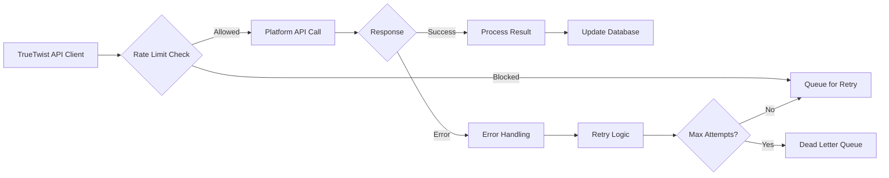

# TrueTwist Data Flow Documentation
## System Architecture & Data Processing Pipelines

### Overview
TrueTwist processes data through multiple interconnected pipelines: content creation, AI generation, scheduling, publishing, analytics, and competitor research. This document outlines the complete data flow from user input to published content and performance tracking.

### System Architecture Diagram

```
┌─────────────────────────────────────────────────────────────────────────────┐
│                         TRUE TWIST SYSTEM ARCHITECTURE                      │
└─────────────────────────────────────────────────────────────────────────────┘

    ┌─────────────┐    ┌─────────────┐    ┌─────────────┐    ┌─────────────┐
    │   Web/API   │    │   Mobile    │    │  CLI/Tools  │    │   Webhooks  │
    │   Layer     │    │   App       │    │             │    │  (External) │
    └──────┬──────┘    └──────┬──────┘    └──────┬──────┘    └──────┬──────┘
           │                  │                  │                  │
    ┌──────▼──────────────────▼──────────────────▼──────────────────▼──────┐
    │                    Application Service Layer                         │
    │  ┌──────────┐ ┌──────────┐ ┌──────────┐ ┌──────────┐ ┌──────────┐  │
    │  │   Auth   │ │  Content │ │   AI     │ │ Scheduling│ │ Analytics│  │
    │  │ Service  │ │ Service  │ │ Service  │ │  Service  │ │ Service  │  │
    │  └──────────┘ └──────────┘ └──────────┘ └──────────┘ └──────────┘  │
    └──────┬──────────────────┬──────────────────┬──────────────────┬─────┘
           │                  │                  │                  │
    ┌──────▼──────────────────▼──────────────────▼──────────────────▼──────┐
    │                    Message Queue Layer (Redis/Bull)                  │
    │  ┌──────────┐ ┌──────────┐ ┌──────────┐ ┌──────────┐ ┌──────────┐  │
    │  │  Post    │ │  Media   │ │ Analytics│ │Competitor│ │  DLQ     │  │
    │  │ Publishing││ Processing││  Fetch   │ │ Scraping │ │  Queue   │  │
    │  │  Queue   │ │  Queue   │ │  Queue   │ │  Queue   │ │          │  │
    │  └──────────┘ └──────────┘ └──────────┘ └──────────┘ └──────────┘  │
    └──────┬──────────────────┬──────────────────┬──────────────────┬─────┘
           │                  │                  │                  │
    ┌──────▼──────────────────▼──────────────────▼──────────────────▼──────┐
    │                    Worker Process Layer                              │
    │  ┌──────────┐ ┌──────────┐ ┌──────────┐ ┌──────────┐ ┌──────────┐  │
    │  │ Platform │ │  Media   │ │ Analytics│ │Scraping  │ │  Admin   │  │
    │  │ Workers  │ │ Workers  │ │ Workers  │ │ Workers  │ │ Workers  │  │
    │  │ (x5)     │ │ (x3)     │ │ (x2)     │ │ (x1)     │ │ (x1)     │  │
    │  └──────────┘ └──────────┘ └──────────┘ └──────────┘ └──────────┘  │
    └──────┬──────────────────┬──────────────────┬──────────────────┬─────┘
           │                  │                  │                  │
    ┌──────▼──────────────────▼──────────────────▼──────────────────▼──────┐
    │                    External Platform APIs                            │
    │  ┌──────┐ ┌──────┐ ┌──────┐ ┌──────┐ ┌──────┐ ┌──────┐ ┌──────┐    │
    │  │Insta-│ │TikTok│ │Twitter│ │Linked│ │Face- │ │You-  │ │Thread│    │
    │  │gram  │ │      │ │      │ │In    │ │book  │ │Tube  │ │ds    │    │
    │  └──────┘ └──────┘ └──────┘ └──────┘ └──────┘ └──────┘ └──────┘    │
    └──────────────────────────────────────────────────────────────────────┘
           │                  │                  │                  │
    ┌──────▼──────────────────▼──────────────────▼──────────────────▼──────┐
    │                    PostgreSQL Database                               │
    │  ┌──────────────────────────────────────────────────────────────┐    │
    │  │                    All Application Data                      │    │
    │  └──────────────────────────────────────────────────────────────┘    │
    └──────────────────────────────────────────────────────────────────────┘
```

### Core Data Flow Pipelines

#### 1. **Content Creation Pipeline**

**Flow: User Input → AI Enhancement → Scheduling → Queue**

```
1. User creates post draft
   ↓
2. Content Service validates & enriches
   ↓
3. AI Service generates suggestions/variations
   ↓
4. User selects platforms & schedule
   ↓
5. Scheduling Service creates queue jobs
   ↓
6. Post saved to database with 'scheduled' status
   ↓
7. Queue jobs added with timezone-aware delays
```

**Data Transformation:**
- Raw user input → Validated content → AI-enhanced variants → Scheduled posts

**Key Services:**
- `ContentService`: Validation, enrichment, template application
- `AIService`: GPT-4o-mini for captions, DALL-E 3 for images
- `SchedulingService`: Timezone conversion, queue job creation

#### 2. **Auto-Posting Pipeline**

**Flow: Queue → Rate Limit Check → Platform API → Status Update**

```
1. Bull queue processes scheduled job
   ↓
2. RateLimitService checks platform limits
   ↓
3. MediaProcessor uploads images/videos
   ↓
4. PlatformClient publishes to social media
   ↓
5. Result captured (success/failure)
   ↓
6. Database updated with platform_post_id
   ↓
7. Analytics fetch queued (5min delay)
   ↓
8. User notified via webhook/notification
```

**Error Handling:**
- Rate limit exceeded → Exponential backoff retry
- Auth failure → Notify user, disable account
- Platform error → Retry with circuit breaker
- Content rejection → Move to DLQ, notify admin

#### 3. **Analytics Pipeline**

**Flow: Published Post → Delayed Fetch → Processing → Insights**

```
1. Post published successfully
   ↓
2. Analytics fetch job queued (5min delay)
   ↓
3. Platform API fetches engagement metrics
   ↓
4. Data normalized across platforms
   ↓
5. Engagement rate calculated
   ↓
6. Insights generated (best time, content type)
   ↓
7. User dashboard updated
   ↓
8. AI suggestions improved with performance data
```

**Metrics Collected:**
- Platform-specific: Likes, comments, shares, saves
- Cross-platform: Engagement rate, reach, impressions
- Derived: Viral score, optimal posting times

#### 4. **Competitor Research Pipeline**

**Flow: Scheduled Scraping → Data Collection → Analysis → Insights**

```
1. Scheduled job runs every 4 hours
   ↓
2. Scraping workers fetch competitor posts
   ↓
3. Data normalized and stored
   ↓
4. Engagement metrics analyzed
   ↓
5. Trend detection algorithms run
   ↓
6. Viral trends identified and scored
   ↓
7. Suggestions generated for users
   ↓
8. Competitor benchmarking updated
```

**Data Sources:**
- Public API endpoints (where available)
- Web scraping (with rate limiting)
- RSS feeds and public datasets

#### 5. **AI Generation Pipeline**

**Flow: User Prompt → Model Selection → Generation → Cost Tracking**

```
1. User submits generation request
   ↓
2. ModelSelector chooses optimal model
   ↓
3. AI client calls appropriate API
   ↓
4. Response validated and formatted
   ↓
5. Usage tracked (tokens, cost)
   ↓
6. Result stored with metadata
   ↓
7. User receives generated content
   ↓
8. Cost allocated to user/subscription
```

**Model Selection Logic:**
- Quality vs cost trade-off
- Fallback providers for redundancy
- User tier considerations (free vs paid)

### Data Storage Strategy

#### 1. **PostgreSQL (Primary Data Store)**
- **Tables**: All structured data (users, posts, analytics, etc.)
- **Indexes**: Optimized for common query patterns
- **Materialized Views**: Pre-aggregated metrics for dashboards
- **Partitioning**: Time-based for audit_logs, queue_metrics

#### 2. **Redis (Queue & Cache)**
- **Bull Queues**: Job management with priorities and delays
- **Rate Limiting**: In-memory counters with TTL
- **Session Storage**: User sessions and temporary data
- **Cache Layer**: Frequently accessed data (templates, config)

#### 3. **Object Storage (Media)**
- **S3/Cloud Storage**: User-uploaded media
- **CDN**: Distributed delivery for images/videos
- **Transformation**: On-the-fly resizing and optimization

### API Data Flow

#### External Platform APIs



**Platform-Specific Considerations:**

| Platform | Rate Limits | Media Requirements | API Stability |
|----------|-------------|-------------------|---------------|
| Instagram | 25 posts/hour | Square/portrait, 2200 chars | High |
| Twitter | 50 posts/15min | 280 chars, 4 images | High |
| TikTok | 100 posts/day | Vertical video, 150 chars | Medium |
| LinkedIn | 50 posts/day | Professional, 3000 chars | High |
| Facebook | 50 posts/hour | Various formats, 5000 chars | Medium |

### Webhook Integration Flow

```
1. Platform sends webhook (post published, analytics updated)
   ↓
2. WebhookHandler validates signature
   ↓
3. Event router processes based on type
   ↓
4. Database updated asynchronously
   ↓
5. User notifications triggered
   ↓
6. Analytics pipeline updated
   ↓
7. Response sent to platform (200 OK)
```

**Webhook Types Handled:**
- `post_published`: Update post status, queue analytics
- `post_failed`: Retry logic, user notification
- `analytics_updated`: Refresh dashboard data
- `rate_limit_warning`: Adjust queue pacing

### Batch Processing Flows

#### 1. **Daily Analytics Aggregation**
```
00:00 UTC: Scheduled job starts
  ↓
Fetch yesterday's post analytics
  ↓
Calculate platform performance
  ↓
Generate user reports
  ↓
Update materialized views
  ↓
Send daily digest emails
  ↓
Cleanup old data (90+ days)
```

#### 2. **Weekly Competitor Analysis**
```
Sunday 02:00 UTC: Analysis job
  ↓
Aggregate competitor data
  ↓
Identify trending content
  ↓
Generate suggestions
  ↓
Update benchmark reports
  ↓
Notify users of opportunities
```

#### 3. **Monthly Billing & Usage**
```
1st of month: Billing job
  ↓
Calculate AI usage costs
  ↓
Generate invoices
  ↓
Update subscription status
  ↓
Process payments
  ↓
Send billing notifications
```

### Data Security & Privacy

#### 1. **Encryption**
- **At Rest**: Database encryption for PII
- **In Transit**: TLS 1.3 for all APIs
- **Tokens**: Encrypted social media access tokens

#### 2. **Access Control**
- **Role-Based**: User, Admin, System levels
- **Resource-Based**: Team and business boundaries
- **API Keys**: Scoped permissions for integrations

#### 3. **Data Retention**
- **User Data**: Retained while account active
- **Analytics**: 2 years for trend analysis
- **Audit Logs**: 90 days for compliance
- **Queue Metrics**: 30 days for monitoring

### Monitoring & Observability

#### 1. **Metrics Collection**
```yaml
metrics:
  queue_depth:
    collection: every_30s
    alert_threshold: 100
  post_success_rate:
    collection: every_5min
    alert_threshold: <95%
  api_latency:
    collection: every_minute
    alert_threshold: >2000ms
  error_rate:
    collection: every_minute
    alert_threshold: >1%
```

#### 2. **Logging Strategy**
- **Structured Logs**: JSON format for parsing
- **Correlation IDs**: Track requests across services
- **Log Levels**: Debug, Info, Warn, Error
- **Retention**: 30 days in centralized log service

#### 3. **Alerting Rules**
- **P1 (Critical)**: Service down, data loss
- **P2 (High)**: Performance degradation, queue buildup
- **P3 (Medium)**: Elevated error rates, rate limiting
- **P4 (Low)**: Informational, capacity planning

### Disaster Recovery

#### 1. **Data Backup**
- **Database**: Hourly snapshots, daily full backups
- **Redis**: RDB snapshots every hour
- **Media**: Versioned in object storage
- **Retention**: 30 days rolling

#### 2. **Recovery Procedures**
- **Database Failure**: Restore from latest snapshot
- **Redis Failure**: Replay from database queue_jobs
- **Worker Failure**: Auto-restart, job reassignment
- **Full Outage**: Failover to secondary region

#### 3. **Testing Schedule**
- **Monthly**: Backup restoration test
- **Quarterly**: Full DR drill
- **Annually**: Business continuity test

### Scaling Considerations

#### 1. **Horizontal Scaling**
- **Workers**: Auto-scale based on queue depth
- **API Servers**: Load balancer with health checks
- **Database**: Read replicas for reporting
- **Redis**: Cluster mode for high availability

#### 2. **Vertical Scaling**
- **Database**: Larger instances for write-heavy loads
- **Redis**: More memory for queue storage
- **Workers**: More CPU for media processing

#### 3. **Cost Optimization**
- **Queue Priorities**: Time-sensitive first
- **AI Model Selection**: Cost-effective defaults
- **Media Processing**: Lazy loading, CDN caching
- **Database**: Connection pooling, query optimization

### Integration Points

#### 1. **Third-Party Services**
- **Stripe**: Subscription management
- **SendGrid**: Email notifications
- **Slack**: Team notifications
- **Zapier**: Workflow automation

#### 2. **Data Exports**
- **CSV**: User data export (GDPR compliance)
- **API**: Webhook endpoints for integrations
- **WebSocket**: Real-time dashboard updates
- **SFTP**: Scheduled reports for enterprises

#### 3. **Import Tools**
- **CSV Upload**: Bulk content scheduling
- **API Import**: Migrate from other platforms
- **Browser Extension**: Quick content capture
- **Mobile Share**: Native sharing integration